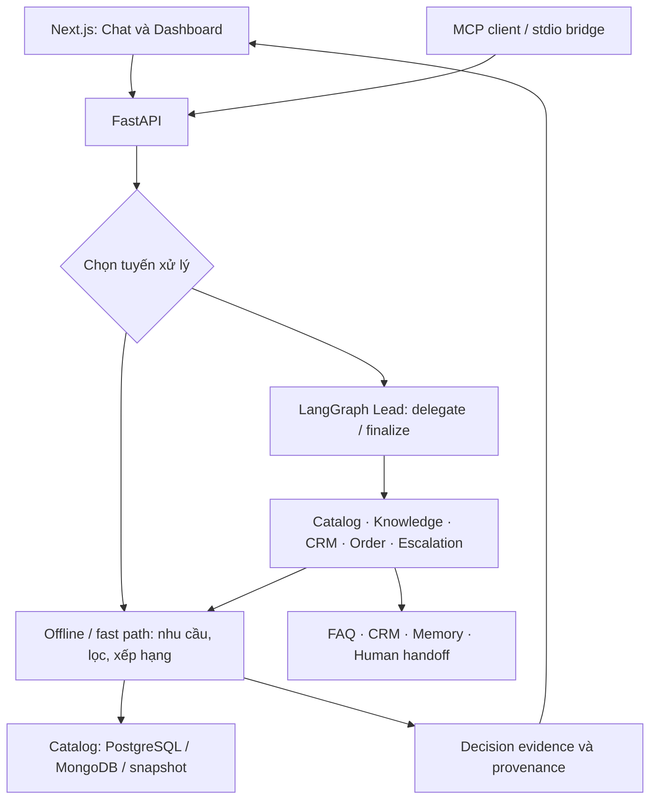

# SalePilot

**Trợ lý tư vấn điện máy và công nghệ bằng tiếng Việt, đề xuất sản phẩm dựa trên nhu cầu và dữ liệu catalog.**

SalePilot hỏi thêm khi thiếu thông tin, lọc theo ngân sách và ràng buộc kỹ thuật, rồi đưa ra tối đa ba lựa chọn kèm lý do và đánh đổi. Giao diện web cho phép xem bằng chứng của từng quyết định, theo dõi Agent Trace và quản lý hội thoại.

Đây là prototype phục vụ phát triển và nghiên cứu, còn được gọi là **SalePilot-R** trong API và tài liệu nghiên cứu. Kênh sản phẩm hiện tại là **Web**.

[Chạy thử](#chạy-thử-cục-bộ) · [Kiến trúc](#kiến-trúc) · [Cấu hình](#cấu-hình) · [Kiểm tra](#kiểm-tra) · [Tài liệu](#tài-liệu)

## Có thể làm gì?

- **Tư vấn theo nhu cầu:** nhận diện ngành hàng, ngân sách, kích thước và các tiêu chí riêng của từng ngành; tiếp tục hỏi để hoàn thiện nhu cầu.
- **Tìm kiếm và so sánh:** tra cứu SKU, lọc catalog và so sánh các lựa chọn trong cùng ngành hàng. Sản phẩm thiếu dữ kiện cho ràng buộc cứng có chính sách `exclude` bị loại khỏi đề xuất.
- **Giải thích đề xuất:** hiển thị tiêu chí phù hợp, trade-off, nguồn SKU, catalog hash và decision hash.
- **Hỏi đáp chính sách:** tìm thông tin trong kho FAQ; truy hồi ngữ nghĩa bằng Chroma là tùy chọn.
- **Hỗ trợ bán hàng:** lưu lead, tạo đơn nháp, ghi nhớ nhu cầu và chuyển hội thoại cho người phụ trách. Đơn nháp chưa phải đơn hàng đã xác nhận.
- **Quan sát hoạt động:** chat streaming, Agent Trace, bằng chứng theo lượt, xuất hội thoại và dashboard quản trị.
- **Chạy không cần khóa AI:** tuyến offline dùng luật và catalog; có khóa API thì có thể sử dụng Lead cùng các specialist qua LangGraph.
- **Kết nối MCP:** bridge Node.js chạy qua stdio, gọi API của backend để tra cứu và tạo lead có xác nhận.

Giá và thông số phụ thuộc catalog đang nạp. Hệ thống không xác nhận tồn kho khi nguồn không cung cấp dữ liệu này.

## Kiến trúc



| Thành phần | Công nghệ / trách nhiệm |
|---|---|
| Backend | Python 3.12+, FastAPI, LangGraph, SQLAlchemy |
| Frontend | Next.js 14, React 18, TypeScript, CSS |
| Catalog | PostgreSQL, MongoDB hoặc JSON snapshot; backend chọn qua cấu hình |
| CRM và hội thoại | PostgreSQL; SQLite cho bản chạy thử cục bộ |
| Kho tri thức | FAQ, lexical retrieval; Chroma embeddings bật riêng khi cần |
| MCP | TypeScript, Node.js 20+, stdio → HTTP backend |

Lõi quyết định nằm ở `recommendation.py`; `consultation.py` đóng gói đề xuất và bằng chứng. `catalog_queries.py` phụ trách đọc/tìm/so sánh sản phẩm; `catalog_domain.py` giữ giao diện import dùng chung. Xem [kiến trúc chi tiết](docs/ARCHITECTURE.md).

## Chạy thử cục bộ

Cần **Python 3.12+**, **Node.js 20+** và npm. Các lệnh bên dưới bắt đầu từ thư mục gốc repo, sử dụng **70 sản phẩm giả lập / 14 ngành hàng** đã có trong Git cùng SQLite; không cần PostgreSQL, MongoDB hoặc khóa API.

Dữ liệu mẫu chỉ dùng kiểm tra kỹ thuật, không phản ánh hàng hóa hay giá bán thực tế. `SALEPILOT_CATALOG_REGISTRY=workbook` cần đi cùng fixture này.

### 1. Khởi động backend

**Bash — Linux, macOS hoặc WSL:**

```bash
python3 -m venv backend/.venv
source backend/.venv/bin/activate
python -m pip install -r backend/requirements.txt

export DATABASE_URL='sqlite+aiosqlite:///./data/salepilot.db'
export POSTGRES_DSN='sqlite:///./data/salepilot.db'
export CATALOG_BACKEND=snapshot
export CATALOG_SNAPSHOT='../experiments/fixtures/catalog_dev_fixture.json'
export SALEPILOT_CATALOG_REGISTRY=workbook
export OPENAI_API_KEY='' ANTHROPIC_API_KEY=''
export RAG_EMBEDDINGS_ENABLED=false

cd backend
python -m scripts.seed_db
python -m uvicorn app.main:app --reload --port 8000
```

<details>
<summary>Windows PowerShell</summary>

```powershell
python -m venv backend/.venv
& ./backend/.venv/Scripts/python.exe -m pip install -r backend/requirements.txt

$env:DATABASE_URL = 'sqlite+aiosqlite:///./data/salepilot.db'
$env:POSTGRES_DSN = 'sqlite:///./data/salepilot.db'
$env:CATALOG_BACKEND = 'snapshot'
$env:CATALOG_SNAPSHOT = '../experiments/fixtures/catalog_dev_fixture.json'
$env:SALEPILOT_CATALOG_REGISTRY = 'workbook'
$env:OPENAI_API_KEY = ''
$env:ANTHROPIC_API_KEY = ''
$env:RAG_EMBEDDINGS_ENABLED = 'false'

cd backend
& ./.venv/Scripts/python.exe -m scripts.seed_db
& ./.venv/Scripts/python.exe -m uvicorn app.main:app --reload --port 8000
```

</details>

Nếu đã có `backend/.env`, bảo đảm không có khóa AI trong file đó khi muốn kiểm tra offline. Các đường dẫn dữ liệu trên được tính từ thư mục `backend`.

### 2. Khởi động frontend trong terminal khác

Từ thư mục gốc repo:

```bash
cd frontend
npm ci
npm run dev
```

| Địa chỉ | Nội dung |
|---|---|
| [localhost:3000/chat](http://localhost:3000/chat) | Tư vấn sản phẩm |
| [localhost:3000/dashboard](http://localhost:3000/dashboard) | Dashboard, cần cấu hình quyền quản trị |
| [localhost:8000/health](http://localhost:8000/health) | Trạng thái, nguồn catalog, số sản phẩm và hash |
| [localhost:8000/docs](http://localhost:8000/docs) | OpenAPI tương tác |

Thử gửi: **“Gia đình 4 người cần tủ lạnh dưới 15 triệu, ngang tối đa 70 cm.”**

Hoặc kiểm tra API bằng Bash:

```bash
curl -s http://localhost:8000/health
curl -s http://localhost:8000/chat \
  -H 'Content-Type: application/json' \
  -d '{"message":"Gia đình 4 người cần tủ lạnh dưới 15 triệu, ngang tối đa 70 cm","external_id":"readme-demo","channel":"web"}'
```

`/health` trả `ready: true` khi catalog có sản phẩm và hash. HTTP 200 với `ready: false` nghĩa là ứng dụng đã chạy nhưng catalog chưa sẵn sàng.

## Cấu hình

Tham khảo [`.env.example`](.env.example) và [Settings](backend/app/config.py). Backend đọc biến môi trường hoặc `.env` trong **thư mục chạy lệnh**; `backend/run.sh` nạp file `../.env` một cách tường minh. Next.js dùng biến môi trường của tiến trình hoặc `frontend/.env.local`.

| Biến | Mục đích |
|---|---|
| `DATABASE_URL` | Kết nối async cho CRM, memory và hội thoại |
| `POSTGRES_DSN` | Kết nối sync cho catalog/FAQ và import |
| `CATALOG_BACKEND` | `postgres` (mặc định), `mongodb` hoặc `snapshot` |
| `CATALOG_SNAPSHOT` | Đường dẫn snapshot; dữ liệu catalog thật không nằm trong Git |
| `SALEPILOT_CATALOG_REGISTRY` | `crawl` cho runtime thông thường; `workbook` cho fixture và benchmark tương ứng |
| `OPENAI_API_KEY`, `ANTHROPIC_API_KEY` | Tùy chọn để dùng LLM; cấu hình thêm `LLM_PROVIDER`, `MODEL_NAME`, `OPENAI_BASE_URL` khi cần |
| `NEXT_PUBLIC_API_URL` | URL backend mà trình duyệt truy cập; mặc định `http://localhost:8000` |
| `BACKEND_URL` | URL backend dành cho proxy quản trị trên server Next.js |
| `ADMIN_API_KEY` | Cùng một khóa trên backend và server Next.js, bảo vệ API quản trị |
| `OWNER_TOKEN` | Khóa riêng trên server Next.js; nhập vào dashboard để xác thực người quản trị |
| `MCP_WRITE_TOKEN` | Cho phép ghi lead qua MCP khi client gửi đúng khóa và có xác nhận |

Chỉ `NEXT_PUBLIC_API_URL` được đưa ra trình duyệt. Các khóa quản trị phải giữ ở server; để trống cấu hình quản trị thì các endpoint được bảo vệ sẽ từ chối truy cập. Sandbox, web fetch và truy hồi embeddings mặc định tắt.

### Catalog thật và Docker

Runtime có thể đọc catalog từ PostgreSQL, MongoDB hoặc snapshot được import. Danh sách ngành hàng thực tế xem tại `GET /products/categories`; số lượng và hash xem tại `/health`.

Các script import nằm trong [backend/scripts](backend/scripts); nguồn dữ liệu và quyền sử dụng được mô tả ở [Dataset Card](docs/DATASET_CARD.md). Chỉ import dữ liệu đã được phép sử dụng. Không đưa workbook, catalog thô, khóa API hay hội thoại khách hàng vào Git.

[Docker Compose](docker-compose.yml) gồm frontend, backend, PostgreSQL, MongoDB và PostgREST. Trước khi chạy:

1. Tạo `.env` cục bộ dựa trên mẫu và cấu hình kết nối dữ liệu phù hợp.
2. Nếu dùng database trong Compose, đổi host của `DATABASE_URL` và `POSTGRES_DSN` thành `postgres:5432`, và host MongoDB thành `mongo:27017`; `localhost` bên trong container là chính container đó.
3. Import catalog. Compose hiện ép `CATALOG_BACKEND=postgres`; chỉ khởi động container không tự tạo dữ liệu catalog thật.
4. Nếu cần dashboard, truyền `ADMIN_API_KEY`, `OWNER_TOKEN` và `BACKEND_URL=http://backend:8000` vào môi trường service frontend; Compose hiện chưa truyền các biến này.

```bash
docker compose up --build
```

Frontend mở cổng `3000`, backend `8000`; PostgreSQL dùng cổng host `5433`, MongoDB `27017`, PostgREST `3001`. Bản demo SQLite ở trên là lựa chọn gọn nhất để thử nhanh.

### MCP

```bash
cd mcp
npm ci
npm run build
```

Cấu hình MCP client chạy `node` với đường dẫn tuyệt đối tới `mcp/dist/index.js` và `SALEPILOT_API_BASE_URL=http://127.0.0.1:8000`. Ghi lead yêu cầu `SALEPILOT_MCP_WRITE_TOKEN` khớp khóa backend và `confirmed: true`. Xem [hướng dẫn bridge](mcp/README.md); số liệu snapshot trong tài liệu cũ không thay cho catalog đang chạy.

## Kiểm tra

Từ repo root, với môi trường backend đã kích hoạt và cài dependencies:

```bash
python scripts/validate_agent_scope.py --self-test
python scripts/validate_agent_scope.py
bash scripts/verify.sh
(cd backend && python -m unittest discover -s tests)
python -m unittest experiments.evaluate.test_metrics
(cd frontend && npx tsc --noEmit && npm run build)
```

`scripts/verify.sh` chọn fixture, registry workbook và SQLite tạm; chạy kiểm tra catalog, chat offline, memory, guardrail và MCP API. Bỏ khóa LLM khỏi môi trường khi kiểm tra offline. Dùng terminal mới để chạy toàn bộ test backend, tránh kế thừa `SALEPILOT_CATALOG_REGISTRY=workbook` từ bản demo. Windows cần Git Bash/WSL cho các lệnh Bash; Python và npm chạy được trong PowerShell.

`init.sh` hỗ trợ cài dependencies, seed, ingest kho tri thức, chạy smoke và ghi mốc kiểm tra phạm vi sửa đổi. Hãy cấu hình database/catalog trước khi dùng vì seed và ingest chạy theo môi trường hiện tại.

## Tài liệu

| Đường dẫn | Nội dung |
|---|---|
| [backend/](backend/) | API, agent, catalog, CRM, memory, script import và tests |
| [frontend/](frontend/) | Chat, dashboard, Agent Trace và decision evidence |
| [mcp/](mcp/) | Bridge MCP cục bộ |
| [docs/ARCHITECTURE.md](docs/ARCHITECTURE.md) | Kiến trúc và ranh giới module |
| [docs/DEMO_SCRIPT.md](docs/DEMO_SCRIPT.md) | Kịch bản demo |
| [experiments/](experiments/) | Benchmark, fixture, evaluator và các kết quả được lưu |
| [docs/RIVF_TRACK2_PROTOCOL.md](docs/RIVF_TRACK2_PROTOCOL.md) | Protocol nghiên cứu |
| [docs/REPRODUCIBILITY.md](docs/REPRODUCIBILITY.md) | Yêu cầu tái lập và provenance |
| [AGENTS.md](AGENTS.md) | Quy tắc làm việc trong repo |
| [feature_list.json](feature_list.json) / [claude-progress.md](claude-progress.md) | Trạng thái tính năng và bằng chứng kiểm tra theo phiên |
| [docs/HARNESS.md](docs/HARNESS.md) | Hướng dẫn harness dành cho coding agent |

Các kết quả nghiên cứu đã lưu là hiện vật lịch sử, không chứng minh bản checkout hiện tại đã tái chạy thí nghiệm. Fixture kỹ thuật không phải dataset công bố; cần đủ dữ liệu nguồn, quyền sử dụng, manifest, seal và bằng chứng kiểm tra trước khi đưa ra kết luận nghiên cứu hoặc triển khai.

## Giấy phép

Mã nguồn và tài liệu trong repo sử dụng **CC BY-NC 4.0**, xem [LICENSE](LICENSE). Quyền đối với catalog, policy corpus, dữ liệu dẫn xuất và kết quả thí nghiệm được quản lý riêng trong [Dataset Card](docs/DATASET_CARD.md) và [research manifest](experiments/manifest.json).
